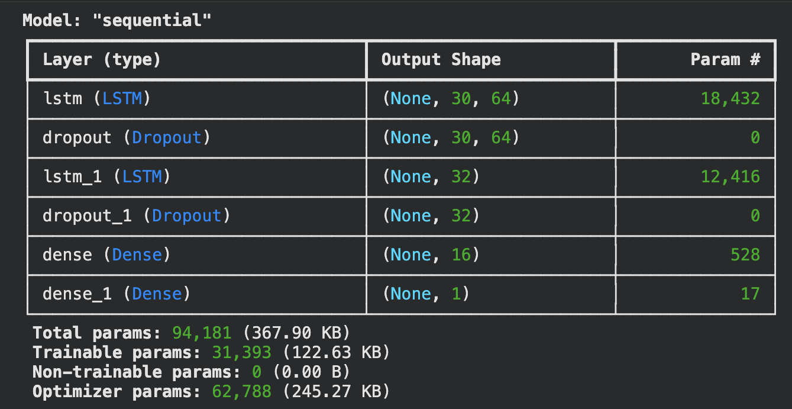
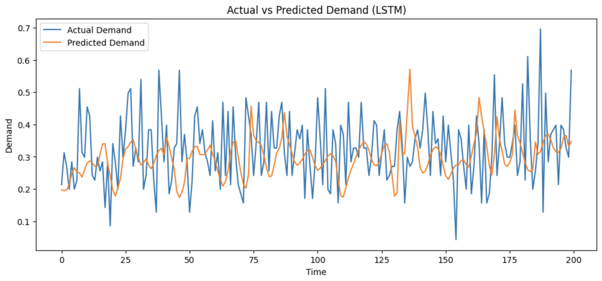

# Retail Demand Forecasting with Synthetic Data

This project explores **retail demand forecasting using both real and synthetic datasets**.  
The objective is to evaluate how well machine learning and deep learning models perform in predicting demand and to assess whether **synthetic data preserves real-world demand patterns**.

The project compares classical machine learning models with a deep learning approach using **LSTM networks**.

---

# Project Goals

• Forecast retail demand using historical data  
• Compare classical ML models vs deep learning  
• Evaluate performance on **real vs synthetic datasets**  
• Analyze whether synthetic data maintains realistic statistical patterns  

---

# Dataset

Two datasets were used:

### Real Dataset
A retail demand dataset containing daily demand values along with temporal patterns.

### Synthetic Dataset
A generated dataset designed to simulate realistic retail demand behavior, including:

- trend patterns
- seasonal fluctuations
- noise
- promotional spikes

The goal was to determine whether models trained on synthetic data behave similarly to models trained on real data.

---

# Feature Engineering

The following features were created to capture temporal dependencies:

- Lag features (`lag_1`, `lag_7`)
- Rolling averages
- Day of week
- Month
- Promotion indicators
- Holiday indicators

These features help models capture short-term and seasonal demand patterns.

---

# Models Implemented

The following models were trained and evaluated:

### Linear Regression
Baseline statistical model.

### Random Forest
Tree-based ensemble model capable of capturing nonlinear relationships.

### LSTM (Long Short-Term Memory)
A deep learning sequence model designed to capture temporal dependencies in time series data.

---

# LSTM Model Architecture

The LSTM model consists of stacked recurrent layers with dropout regularization.

Architecture Summary:

- LSTM Layer (64 units)
- Dropout
- LSTM Layer (32 units)
- Dropout
- Dense Layer (16 units)
- Output Layer (1 unit)

---

# Model Performance

The models were evaluated using **Mean Absolute Error (MAE)**.

| Model | Dataset | MAE |
|------|------|------|
| Linear Regression | Real | 2.41 |
| Random Forest | Real | 2.43 |
| LSTM | Real | 5.03 |

Observation:

Tree-based models performed better than the LSTM model on this dataset, likely due to strong feature engineering capturing most temporal relationships.

---

# Actual vs Predicted Demand

The LSTM model captures overall trends but struggles with sharp demand fluctuations.

---

# Real vs Synthetic Demand Comparison

The demand trends for real and synthetic datasets show similar statistical patterns.

This indicates that the synthetic dataset preserves key temporal demand characteristics.

---

# Monthly Demand Distribution

To compare seasonal behavior, monthly demand distributions were analyzed.

The distributions show that the synthetic dataset maintains similar seasonal variability.

---

# Statistical Comparison

Descriptive statistics were compared between real and synthetic datasets using `df.describe()`.

This analysis verifies that the synthetic data maintains similar statistical properties such as:

- mean demand
- variance
- range of values

---

# Key Findings

• Random Forest and Linear Regression outperformed the LSTM model  
• Feature engineering captured most temporal dependencies in the data  
• Synthetic data demonstrated similar statistical and temporal patterns to the real dataset  
• Synthetic datasets can potentially be used for forecasting experiments when real data is limited  

---

# Technologies Used

- Python
- Pandas
- NumPy
- Matplotlib
- Seaborn
- Scikit-learn
- TensorFlow / Keras

---

# Repository Structure
